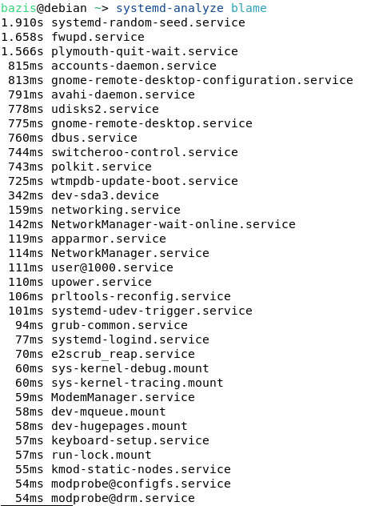
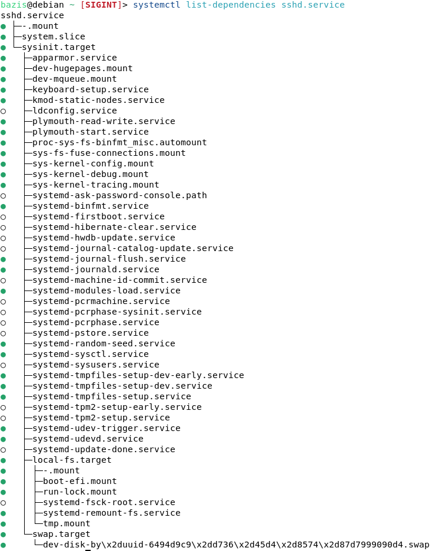

# Linux ЛР4

---

## Часть 1. Получение информации о времени загрузки

### 1) Вывод общей информации о времени загрузки.

````sh
systemd-analyze
````

### Отобразит общее время загрузки системы, разбитое на время ядра, загрузчика и пользовательских процессов.


### 2. Список сервисов в порядке уменьшения времени запуска.

````sh
systemd-analyze blame
````

### Отобразится список юнитов-сервисов с указанием времени, потраченного на их запуск.


### 3. Вывод списка зависимостей для сервиса sshd.

````sh
systemctl list-dependencies sshd.service
````

### В выводе отобразятся все юниты, от которых зависит sshd.


