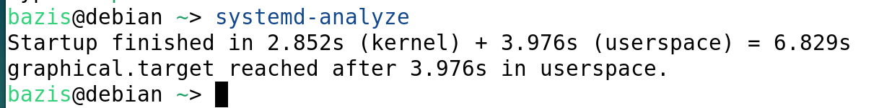
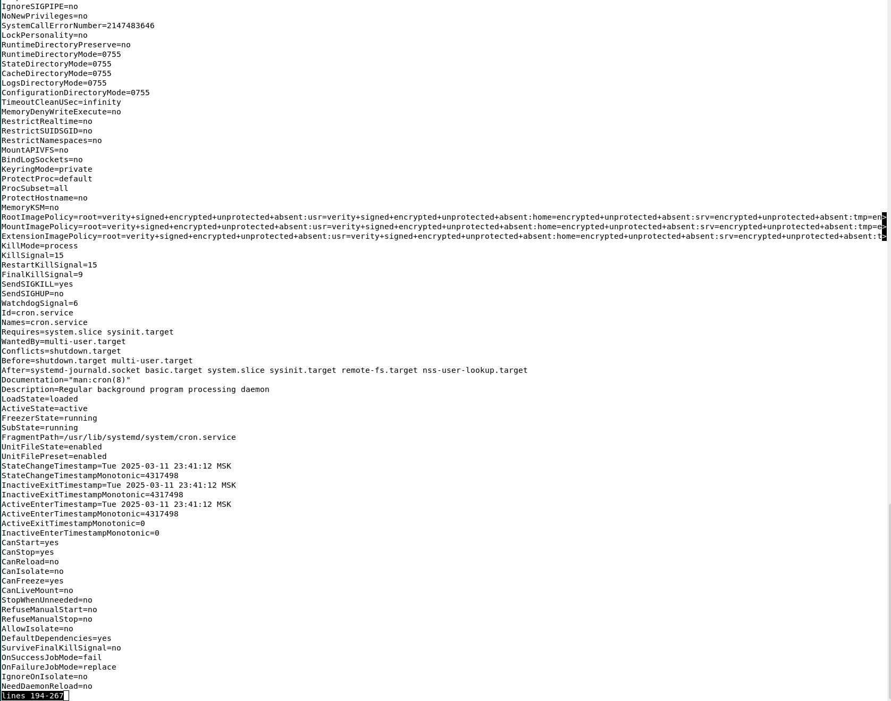

# Linux ЛР4

---

## Часть 1. Получение информации о времени загрузки


### 1) Вывод общей информации о времени загрузки.

````shell
systemd-analyze
````

### Отобразит общее время загрузки системы, разбитое на время ядра, загрузчика и пользовательских процессов.



### 2) Список сервисов в порядке уменьшения времени запуска.

````shell
systemd-analyze blame
````

### Отобразится список юнитов-сервисов с указанием времени, потраченного на их запуск.


### 3) Вывод списка зависимостей для сервиса sshd.

````shell
systemctl list-dependencies sshd.service
````

### В выводе отобразятся все юниты, от которых зависит sshd.


### 4) Построение графика загрузки в формате SVG.

````shell
systemd-analyze plot > boot.svg
````


---

## Часть 2. Управление юнитами


### 1) Получение списка запущенных юнитов сервисов.

````shell
systemctl list-units --type=service --state=running
````


### 2) Перечень юнитов с автозапуском.

````shell
systemctl list-unit-files --type=service | grep enabled
````


### 3) Определение зависимостей сервиса sshd.

````shell
systemctl list-dependencies sshd.service
````

### Вывод список юнитов, от которых зависит сервис sshd.


### 4) Проверка и запуск сервиса cron.

````shell
systemctl status cron.service
````
### Если сервис не запущен, его можно запустить следующим образом:
````shell
systemctl start cron.service
````


### 5) Вывод всех параметров юнита cron.

````shell
systemctl show cron.service
````





### 6) Отключение автозапуска для cron.

````shell
systemctl stop cron.service
systemctl disable cron.service
````


---

## Часть 3. Создание собственного сервиса mymsg


### 1) Подготовка скрипта в /usr/local/bin/mymsg.sh

````shell
#!/bin/bash

/usr/bin/logger "System boot at $(date)"
````

### 2) Создание файла юнита в /etc/systemd/system/mymsg.service

````service
[Unit]
Description=My Message Service: writes date and time to the system log
After=network-online.target
Wants=network-online.target

[Service]
Type=oneshot
ExecStart=/usr/local/bin/mymsg.sh
RemainAfterExit=yes

[Install]
WantedBy=multi-user.target
````

#### After=network-online.target и Wants=network-online.target – гарантируют, что сервис запустится только после того, как сеть будет доступна.
#### Type=oneshot используется для разового выполнения команды.
#### RemainAfterExit=yes позволяет считать сервис запущенным даже после завершения скрипта.


### 3) Автоматизация и запуск

````shell
systemctl enable mymsg.service

systemctl start mymsg.service
````

````shell
systemctl status  mymsg.service
````

### Проверим, что наш сервис работает


---

## Часть 4. Работа с системным журналом


### 1) Вывод всего системного журнала.

````shell
journalctl
````


### Чтобы просмотреть сообщения текущей загрузки, можно добавить флаг -b.


### 2) Просмотр сообщений, касающихся сервиса mymsg.

````shell
journalctl -u mymsg.service
````


### 3) Вывод сообщений об ошибках.

````shell
journalctl -p err
````


### или

````shell
journalctl -p 3
````


### 4) Определение размера журнала.

````shell
journalctl --disk-usage
````


---

## Часть 5. Создание и настройка .mount юнита


### 1) Подготовка файловой системы

#### I) Раздел/устройство:
##### Я буду использовать /dev/sdb1.


#### II) Форматирование в ext4:

````shell
mkfs.ext4 /dev/sdb1
````


#### III) Создание точки монтирования:

````shell
mkdir -p /mnt/mydata
````


### 2) Создание файла .mount юнита в /etc/systemd/system/mnt-mydata.mount

````service
[Unit]
Description=Mounting a partition /mnt/mydata

[Mount]
What=/dev/sdb1
Where=/mnt/mydata
Type=ext4
Options=defaults

[Install]
WantedBy=multi-user.target
````


### 3) Запуск и проверка

#### I) Включение юнита:

````shell
systemctl enable mnt-mydata.mount
````

#### II) Запуск:

````shell
systemctl start mnt-mydata.mount
````

### III) Проверка статуса:

````shell
systemctl status mnt-mydata.mount
````


### IV) Убедимся, что раздел смонтирован:

````shell
mount | grep /mnt/mydata
````


---

## Часть 6. Использование .automount для отложенного монтирования


### 1) Подготовка

### Нужно выполнить [пункт 5](#Часть-5.-Создание-и-настройка-.mount-юнита) если он еще не выполнен


### 2) Создание файла .automount юнита в /etc/systemd/system/mnt-mydata.automount

````service
[Unit]
Description=Automount for /mnt/mydata

[Automount]
Where=/mnt/mydata
TimeoutIdleSec=30

[Install]
WantedBy=multi-user.target
````


### 3) Запуск и проверка

#### I) Включаем юнит:

````shell
systemctl enable mnt-mydata.automount
````


#### II) Запуск:

### Чтобы не было ошибок
````shell
sudo umount /mnt/mydata
````

````shell
systemctl start mnt-mydata.automount
````

### III) Проверка статуса:

````shell
systemctl status mnt-mydata.automount
````


### IV) Проверка автоматического монтирования, обратившись к точке:

````shell
ls /mnt/mydata
````


### V) После периода бездействия (30 секунд) проверяем, что раздел отмонтировался:

````shell
mount | grep /mnt/mydata
````


---

## Вопросы и задания


### 1) Чем отличаются команды systemctl restart и systemctl try-restart?

`systemctl restart`: Останавливает сервис, если он запущен, и запускает его заново. Если сервис не был запущен, он будет запущен.

`systemctl try-restart`: Перезапускает сервис только в том случае, если он уже запущен. Если сервис не активен, команда не выполняет никаких действий.

Таким образом, `try-restart` используется для «мягкого» перезапуска, когда не нужно запускать сервис, который и так не работает.


### 2) Как с помощью systemctl запустить Linux в однопользовательском режиме?

Для перехода в однопользовательский режим (режим спасения) можно выполнить:
`systemctl isolate rescue.target`
Либо, если требуется более минимальная среда,
`systemctl isolate emergency.target`


### 3) Создание сервиса mysrv с условиями:

ТЗ:
* Сервис `mysrv` не должен запускаться автоматически.

* Его запуск возможен только после того, как сервис `mymsg` был принудительно остановлен уже после старта системы.

#### mymsg.service

````service
[Service]
Type=oneshot
ExecStart=/usr/local/bin/mymsg.sh
RemainAfterExit=yes
````

Параметр RemainAfterExit=yes гарантирует, что даже после завершения работы сервиса он будет считаться активным.

#### mysrv.service

````service
[Unit]
Description=My SRV Service – запуск возможен только если mymsg остановлен
Conflicts=mymsg.service
After=mymsg.service

[Service]
Type=simple
ExecStart=/usr/bin/echo "mysrv запущен, mymsg остановлен"
````

* `Conflicts=mymsg.service` — этот параметр предотвращает одновременный запуск `mysrv` и `mymsg`. Если `mymsg` активен, попытка запустить `mysrv` приведёт к остановке `mymsg`.

* Отсутствие секции `[Install]` (или её неактивация через `systemctl enable`) гарантирует, что `mysrv` не будет запускаться автоматически при загрузке системы.

* Таким образом, сервис `mysrv` можно запустить вручную (или по зависимости других юнитов) только после остановки сервиса `mymsg` (например, с помощью команды `systemctl stop mymsg.service`).