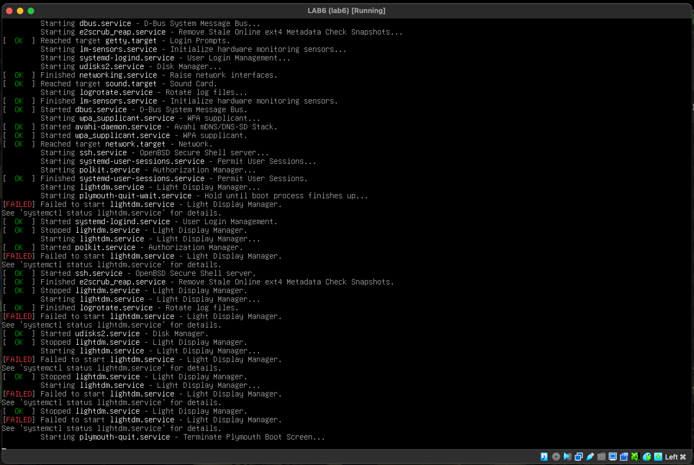

# 4 Вариант

# Исправление ошибки в работе образа

При запуске видим ошибки по поводу того, что не удалось запустить ``lightdm.service``



# Шаг 1 - поиск причины

- открываем режим восстановления


- пытаемся перезапустить сервис


- смотрим логи 

```shell 
cat /var/log/lightdm/lightdm.log > tmp.txt
nano tmp.txt
```

```shell
journalctl -xeu lightdm.service
```

- видим странный лог (в самом верху скриншота)


- пытаемся понять откуда это взялось

```shell
dpkg --verify lightdm
```


Тут видно, что файл ``/usr/sbin/lightdm`` был изменен вручную.

- проверяем этот файл

```shell
file /usr/sbin/lightdm
cat /usr/sbin/lightdm
```


Видно, что ``/usr/sbin/lightdm`` это теперь не бинарный файл, а shell-скрипт.

# Проблема

При запуске видим ошибки по поводу того, что не удалось запустить ``lightdm.service`` 
по причине того, что бинарный файл ``/usr/sbin/lightdm`` был заменен на скрипт, который не давал системе запуститься.

# Шаг 2 - восстановление поврежденного файла

```shell
apt update
apt install lightdm --reinstall
```


После чего можно перезагружаться

```shell
reboot
```


# Решение

Переустановка ``lightdm``

# Анализ

Был поврежден файл ``/usr/sbin/lightdm``. Туда был вставлен shell-скрипт, который прерывает юнит. Моё решение восстанавливает lightdm до исходного состояния.
Поскольку был поврежден большой бинарник, я использовал  ``apt install lightdm --reinstall``, чтобы переустановить пакет.


# Задание - система с установленной DE, должна загружаться до рабочего стола

```service
[Seat:*]
...
...
autologin-user=myuser
autologin-user-timeout=0
...
...
```
